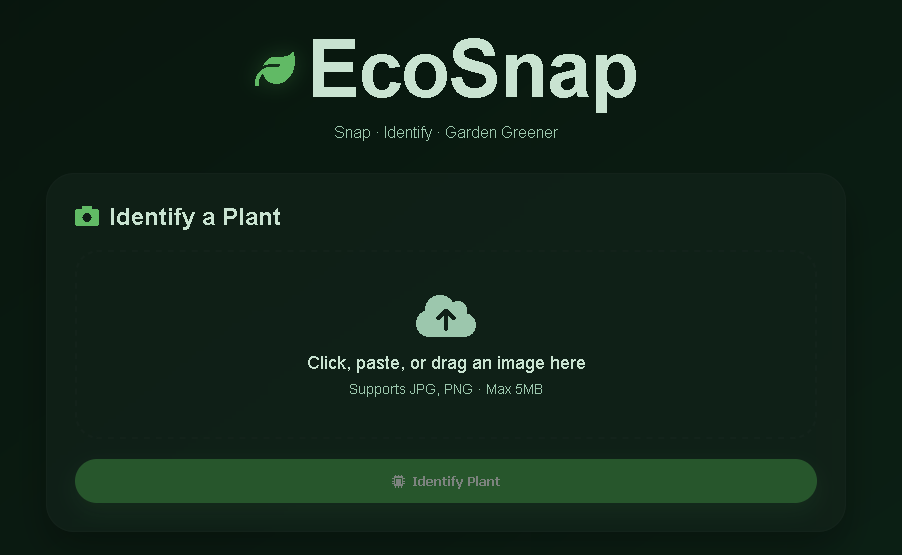
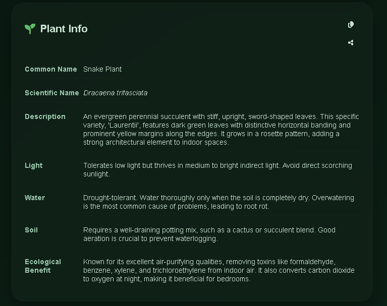
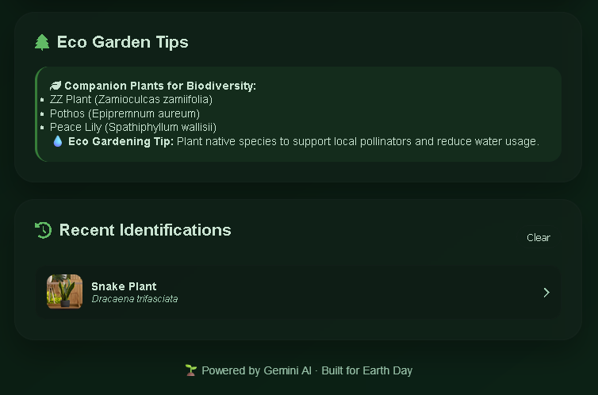

# 📸 EcoSnap — AI Plant Identifier & Eco Garden Advisor

*This is a submission for the [DEV Weekend Challenge: Earth Day Edition](https://dev.to/challenges/weekend-2026-04-16)*


**EcoSnap** is a privacy‑first, AI‑powered plant identifier that helps you discover, care for, and garden with native plants to support local biodiversity. Snap a photo, get instant identification, and receive eco‑friendly gardening tips — all powered by Google's Gemini AI.

🌱 **Live Demo:** [ecosnap-alpha.vercel.app](ecosnap-alpha.vercel.app)  [ecosnaps.netlify.app](ecosnaps.netlify.app)
📦 **GitHub Repository:** [github.com/setuju/ecosnap](https://github.com/setuju/ecosnap)

---

## ✨ Features

| Feature | Description |
|:---|:---|
| 🔍 **Instant Plant ID** | Upload or snap a photo to identify thousands of plant species. |
| 📋 **Detailed Plant Info** | Common name, scientific name, description, and care instructions. |
| 🌿 **Eco Gardening Tips** | Native companion plants and tips to support pollinators and biodiversity. |
| 📷 **Camera & Paste Support** | Use your camera, drag‑and‑drop, or paste from clipboard. |
| 🕒 **Recent History** | Automatically saves your last 10 identifications locally. |
| 📤 **Share & Copy** | Copy plant info or share results with a single click. |
| 🔒 **Privacy First** | Images are sent directly to Gemini API; no data is stored on any server. |
| 🌓 **Beautiful UI** | Glassmorphic design, fully responsive, and easy on the eyes. |

---

## 📸 Screenshots

| Main Interface | Plant Identification | Eco Tips |
|:---:|:---:|:---:|
|  |  |  |

---

## 🛠️ Tech Stack

- **Frontend:** HTML5, CSS3 (Glassmorphism, CSS Grid/Flexbox), Vanilla JavaScript (ES6+)
- **AI Model:** Google Gemini 2.5 Flash (free tier)
- **Storage:** LocalStorage for anonymous history
- **Deployment:** Vercel (static hosting)
- **Dev Server:** Python `http.server`

---

## 🚀 Getting Started (Run Locally)

### Prerequisites
- A modern browser (Chrome, Firefox, Safari)
- A [Gemini API Key](https://aistudio.google.com/apikey) (free)

### Installation

1. **Clone the repository:**
   ```bash
   git clone https://github.com/setuju/ecosnap.git
   cd ecosnap
   ```
2. **Add your API Key:**  
   Edit `config.js` and replace `YOUR_API_KEY` with your actual Gemini key.
   ```javascript
   window.ENV = {
       GEMINI_API_KEY: 'YOUR_API_KEY'
   };
   ```
3. **Start the development server:**
   ```bash
   python -m http.server 8000
   ```
   or you can run the code :
   ```python
   python server.py
   ```

4. **Open in browser:**
   Navigate to `http://localhost:8000` to see EcoSnap in action start identifying plants!
    
4. **Open your browser:**  
   Visit `http://localhost:8000` and start identifying plants!

---

## ☁️ Deploy to Vercel

1. Push your code to GitHub.
2. Go to [Vercel](https://vercel.com) and import the repository.
3. Add an Environment Variable:
   - **Name:** `GEMINI_API_KEY`
   - **Value:** Your Gemini API key
4. Deploy! Your app will be live in seconds.

---

## 🧠 How It Works

1. User uploads an image (or uses camera/paste).
2. The image is converted to Base64 and sent to the Gemini API with a carefully crafted prompt.
3. Gemini returns a structured JSON object containing plant details and companion suggestions.
4. The result is displayed beautifully, and optionally saved to LocalStorage for later reference.

---
## 🌍 Built for the DEV Weekend Challenge

EcoSnap was crafted with purpose during the **[DEV Weekend Challenge: Earth Day Edition](https://dev.to/challenges/weekend-2026-04-16)** — a global hackathon celebrating climate action through technology. This project embodies the challenge's core theme: **"Build for the Planet."**

<div align="center">

[](https://dev.to/challenges/weekend-2026-04-16)
[](https://ai.google.dev/)
[](https://github.com/features/copilot)

</div>

### 🎯 Our Mission

Biodiversity starts at home. EcoSnap empowers anyone — from urban apartment dwellers to seasoned gardeners — to **identify plants instantly** and make ecologically sound gardening choices. By suggesting **native companion plants** and sustainable care tips, we hope to inspire a wave of pollinator‑friendly green spaces, one snap at a time.

### 💡 Why This Matters

- **Educational:** Demystifies plant identification and encourages learning about local flora.
- **Actionable:** Every scan provides concrete steps to improve biodiversity (e.g., planting milkweed for monarch butterflies).
- **Accessible:** No login, no tracking — just point your camera and learn.

### 📣 Share Your Experience

We'd love to see what you discover! If you use EcoSnap to identify a plant or start a native garden, share it on social media with **#EcoSnap** and **#DEVChallenge**. Tag [@thepracticaldev](https://twitter.com/thepracticaldev) and let's show the world how technology can nurture nature.

---

## 🏆 Prize Categories (DEV Challenge)

This project is officially submitted for the following prize categories:

| Category | Relevance |
| :--- | :--- |
| **Best Use of Google Gemini** | EcoSnap relies entirely on Gemini 2.5 Flash for vision‑based plant identification and structured data generation. Our prompt engineering ensures accurate, JSON‑formatted responses that power the entire user experience. |
| **Best Use of GitHub Copilot** | Copilot significantly accelerated development by generating boilerplate for the Gemini API call, writing robust JSON parsing fallbacks, and scaffolding the share/copy UI logic. This allowed us to focus on the user journey and ecological accuracy. |

---

## 🤝 Contributing

EcoSnap is an open‑source project, and contributions are warmly welcomed! Whether it's adding new plant databases, improving prompt accuracy, or refining the UI, your help makes a difference.

1.  Fork the repository.
2.  Create your feature branch (`git checkout -b feature/amazing-feature`).
3.  Commit your changes (`git commit -m 'Add some amazing feature'`).
4.  Push to the branch (`git push origin feature/amazing-feature`).
5.  Open a Pull Request.

---

## 📬 Feedback & Contact

Found a bug? Have a suggestion? Please [open an issue](https://github.com/setuju/ecosnap/issues) on GitHub.  
For direct inquiries, you can reach me on DEV: [@setuju](https://dev.to/setuju).

---

## 📜 License

Distributed under the MIT License. See `LICENSE` for more information.

---

## 🙏 Acknowledgements

- **Google Gemini API** for providing a generous free tier and powerful vision capabilities.
- **Font Awesome** for the beautiful, consistent icon set.
- **The DEV Community** for fostering this inspiring challenge and supporting developers who build for good.
- **GitHub Copilot** for being an invaluable AI pair programmer throughout this sprint.

---
[POC](assets/EcoSnap_AI_Plant_Identifier.png)
[OMG I CAN'T BELIEVE THIS WORKED!](ecosnap-alpha.vercel.app)
---
<div align="center">

**🌱 Every plant you identify is a vote for a greener, more biodiverse planet.**  
*Happy snapping — and happy Earth Day!*

</div>
